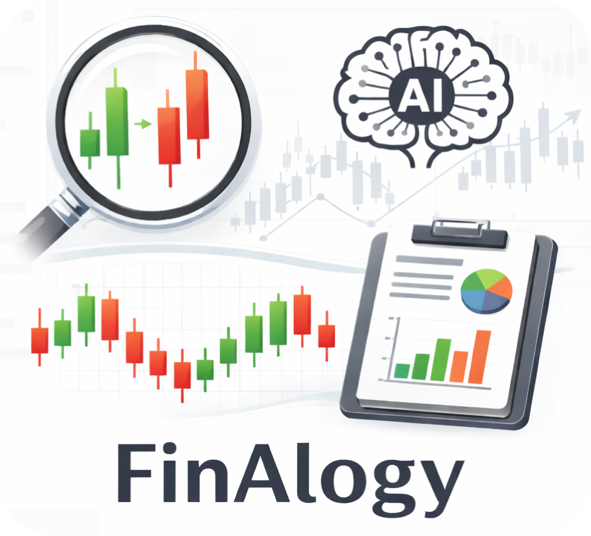

<p align="center">
  
</p>

# FinAlogy: A Visual Analogy Retrieval System for Financial K-Line Analysis

[](https://opensource.org/licenses/MIT)
[](https://huggingface.co/ZiyaZhao/FinAlogy)
[](https://youtu.be/oq1_hxYAE9M)

> FinAlogy shifts financial K-line analysis from **rigid pattern classification** to **data-driven visual analogy**. Upload a candlestick chart or provide OHLC data, retrieve similar historical windows via learned morphology-aware embeddings, and generate LLM-based analysis reports grounded in historical evidence.

🎬 **Watch the demo video**: [https://youtu.be/oq1_hxYAE9M](https://youtu.be/oq1_hxYAE9M)

---

## 📜 Introduction

Traditional financial analysis relies on a fixed taxonomy of candlestick patterns (e.g., "Hammer", "Engulfing"). Yet these predefined rules fail to cover the vast diversity of real-world K-line sequences. Analysts need to ask: *"When did the market show a similar shape before? What happened next?"*—but rigid classification cannot answer this.

**FinAlogy** addresses this gap with a three-stage pipeline:

1. **Visual Encoder**: A CLIP-ViT-B/32 backbone fine-tuned with VICReg self-supervised learning on large-scale DOW30 historical K-line data (2010–2021), capturing morphological features such as body size, shadow structure, and local trend direction while remaining invariant to absolute price scales.
2. **Retrieval Module**: K-NN search over a vector database of historical K-line segments, returning the top-k most morphologically analogous cases with their subsequent price movements.
3. **RAG Pipeline**: An LLM synthesizes retrieved historical cases into professional, interpretable analytical reports covering trend outlook, key price levels, and risk warnings.

---

## ✨ Features

- **Dual input**: Upload a K-line chart image, or paste OHLC (Open, High, Low, Close) data.
- **Morphology-aware retrieval**: Embedding-based retrieval finds analogous historical patterns beyond textbook formations.
- **Evidence-grounded reports**: LLM produces structured analysis with direct references to retrieved historical cases.
- **Interactive UI**: Next.js frontend with chat-style interface, follow-up dialogue, and session history.

---

## 🚀 Getting Started

### Requirements

- **Node.js** 18+
- **pnpm** or **npm**
- **Python** 3.11+ (backend API)
- **Conda** (recommended) or pip

### Installation

**1. Clone the repository**

```bash
git clone https://github.com/nice-zzy/FinAlogy.git
cd FinAlogy
```

**2. Install Node dependencies**

```bash
pnpm install
# or
npm install
```

**3. Set up the Python environment**

Option A: Conda (recommended)
```bash
conda env create -f environment.yml
conda activate kline-env
```

Option B: pip
```bash
pip install -r requirements.txt
```

**4. Download pretrained model and demo data**

We provide a pretrained VICReg encoder checkpoint and a set of demo K-line instances on [HuggingFace](https://huggingface.co/ZiyaZhao/FinAlogy), so you can get started right away without training from scratch.

```python
from huggingface_hub import hf_hub_download

# Download pretrained checkpoint
hf_hub_download(
    repo_id="ZiyaZhao/FinAlogy",
    filename="checkpoint_best.pth",
    local_dir="./checkpoints"
)

# Download demo instances
hf_hub_download(
    repo_id="ZiyaZhao/FinAlogy",
    filename="finalogy_demo_instances.zip",
    local_dir="./data"
)
```

Or manually download from: https://huggingface.co/ZiyaZhao/FinAlogy

**5. Configure environment variables**

```bash
cp apps/web/.env.example apps/web/.env.local
```

Edit `apps/web/.env.local`:

| Variable | Description |
|---|---|
| `NEXT_PUBLIC_SUPABASE_URL` | Supabase project URL |
| `NEXT_PUBLIC_SUPABASE_ANON_KEY` | Supabase anon key |
| `NEXT_PUBLIC_API_URL` | Backend API base URL (default: `http://localhost:8000`) |

> If you don't need sign-in features, you can leave these empty; some features may be limited.

**6. Run the project**

```bash
pnpm dev
# or
npm run dev
```

- **Frontend**: http://localhost:3000
- **Backend API**: http://localhost:8000

---

## 📦 Project Structure

```
FinAlogy/
├── apps/web               # Next.js frontend
├── services/api           # FastAPI backend (inference, retrieval)
├── services/training      # VICReg training and evaluation
├── docs/                  # Documentation and assets
│   └── results.md         # Quantitative evaluation results
├── main.py                # Training pipeline entrypoint
├── environment.yml        # Conda environment
└── requirements.txt       # pip requirements
```

---

## 🔧 Scripts

| Command | Description |
|---|---|
| `pnpm dev` | Start frontend and backend together |
| `pnpm dev:web` | Start frontend only |
| `pnpm dev:api` | Start backend API only |
| `pnpm build` | Build frontend for production |

---

## 📊 Quantitative Results

See [docs/results.md](docs/results.md) for full evaluation results, including:
- Loss function comparison (VICReg vs. Barlow Twins vs. SimSiam)
- VICReg hyperparameter tuning
- Comparison with Kronos baseline

Key result: our VICReg encoder achieves **52D morphological alignment of 0.910**, outperforming Barlow Twins (0.785) and SimSiam (0.814). On downstream retrieval, FinAlogy achieves **52D similarity of 0.610**, outperforming the Kronos autoregressive baseline (0.504).

---

## 🏋️ Training Pipeline (Optional)

If you'd like to train the visual encoder from scratch or regenerate the retrieval index:

```bash
conda activate kline-env
python main.py --steps all
# or run specific steps: --steps 1,2,3,3.5,4,5
```

See comments in `main.py` for details.

---

## 📄 Citation

If you find this work useful, please cite:

```bibtex
@article{yu2025finalogy,
  title   = {FinAlogy: A Visual Analogy Retrieval System for Financial K-Line Analysis},
  author  = {Yu, Xiaoyan and Zhao, Ziya and Wei, Yifan and Sui, Dianbo and Ma, Yunshan and Chua, Tat-Seng},
  journal = {arXiv preprint arXiv:XXXX.XXXXX},
  year    = {2025}
}
```

---

## 📜 License

This project is licensed under the [MIT License](LICENSE).
